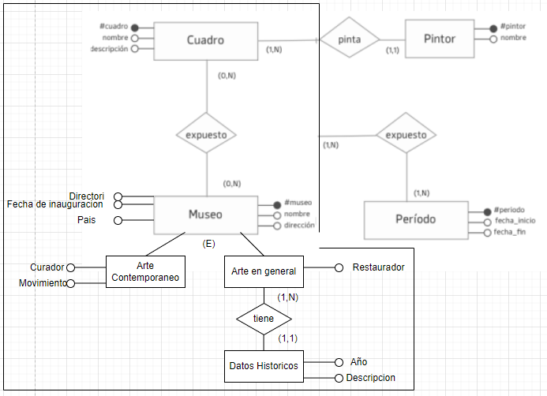
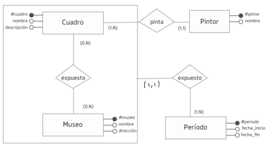
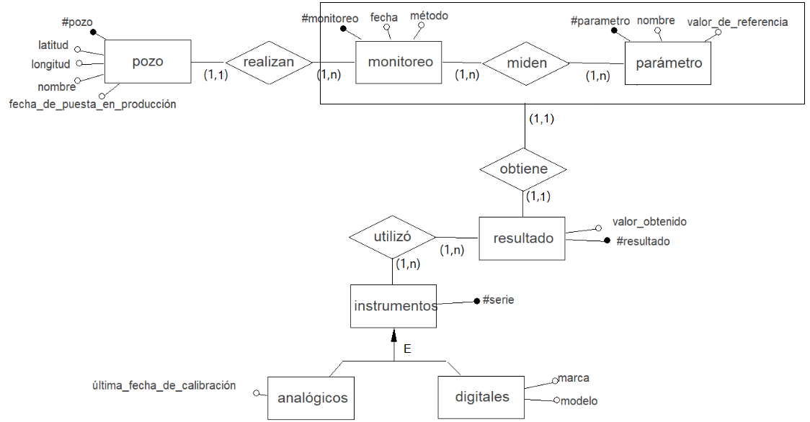
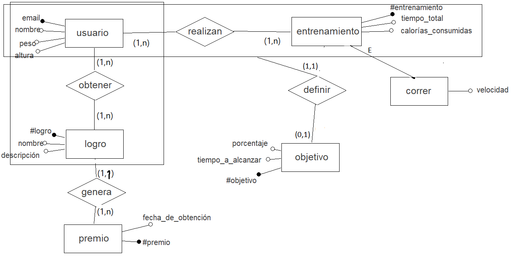
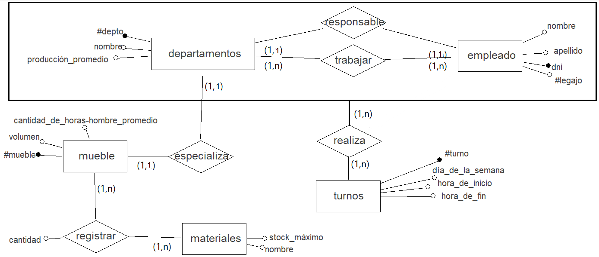
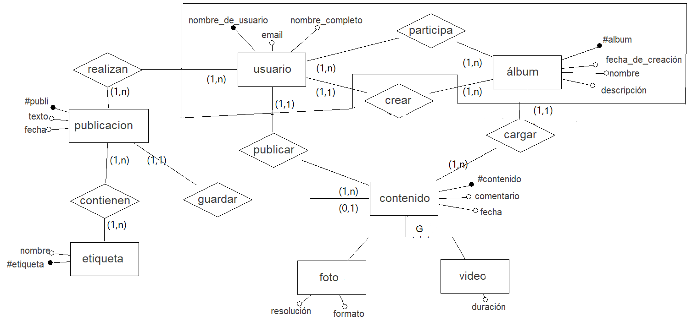
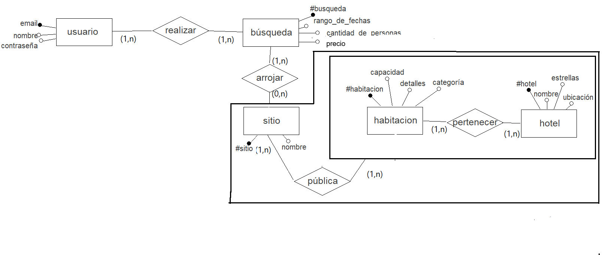
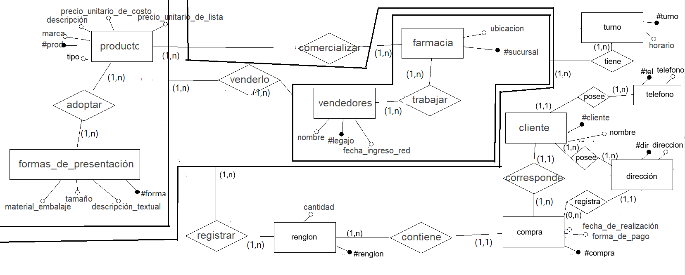

# Práctica 1

1.  1. La indica la agregación de Cuadro y Museo que se conectan mediante la relación `expuesto`con la entidad Período y tienen como cardinalidad (1,N). Para que cada período sea exclusivo de cada cuadro de un museo entonces cambiaría la cardinalidad a (1,1).

       

    2. Cambiaría ahora la cardinalidad que está sobre Periodo a (1,1). **_//SE PODRÍA SACAR LA AGREGACIÓN Y HACER LA RELACION EXPUESTO DIRECTO CON MUSEO?_**
    3. Hago una generalización de Museo y como no pueden haber atributos compuestos haría una entidad nueva llamada Datos Históricos.

       

2.  1. Verdadero.
    2. Falso.
    3. Falso. Debe tenerlo.
    4. Falso. Si es necesario sí, aporta información extra.
3.  1. Falso. Sólo interesa saber si las personas Físicas tienen monotributo.
    2. Verdadero.
    3. Verdadero. Pero repite datos.
    4. Falso. Si pueden haber.
    5. No entendí
    6. Falso. Se puede saber el monto acumulado, no así el que queda ya que no es un dato.
    7. Falso. Tiene redundancia en Persona.
4.  1. Cuando quiero saber en qué momento se realizó la “relación” entre el vendedor y el local.
    2. Cuando se quiere ver al vendedor y al local como una sola entidad y que puede repetirse, sacandole individualidad. Además, puede tener varias fechas de ingreso.
    3. Se esta marcando el horario en el que el vendedor trabaja en ese local. La cardinalidad sería: (1,1) ya que al tener la agregación se considera como una entidad al vendedor-local y (1,N) porque puede trabajar en varios lugares con distintos horarios.
5.  1. Verdadero.
    2. Verdadero.
    3. Falso. La clave debería ser `idic`.
    4. Verdadero. Es una opción.
    5. Falso.
6.  Modelo E/R:

    

    Modelo relacional:

    - Pozo (**#pozo**, latitud, longitud, nombre, fecha)
    - Monitoreo (**#monitoreo**, fecha, método)
    - parámetro (**#parametro**, nombre, valor_de_ref)
    - resultado (**#resultado**, valor_obtenido)
    - analogic (**#serie**, ultima_fecha)
    - digital (**#serie**, marca, modelo)
    - realizan (#pozo, **#monitoreo**)
    - miden (**#monitoreo**, **#parametro**)
    - obtiene (**#monitoreo**, **#parametro**, #resultado)
    - utilizó (**#resultado**, #serie)

7.  Modelo E/R:

    

    Modelo relacional:

    - usuario (**email**, nombre, peso, altura)
    - entrenamiento (**#entrenamiento**, tiempo, calorias)
    - logro (**#logro**, nombre, descripcion)
    - premio (**#premio**, fecha)
    - objetivo (**#objetivo**, tiempo, porcentaje)
    - correr (**#entrenamiento**, velocidad)
    - realizan (**email**, **#entrenamiento**)
    - obtener (**email, #logro**)
    - genera (**#logro, email**, #premio)
    - definir (**#objetivo**, #entrenamiento)

8.  Modelo E/R:

    

    Modelo relacional:

    - empleado (**dni**, nombre, apellido, #legajo)
    - departamento (**#depto**, nombre, prod)
    - turno (**#turno**, dia, hora_inicio, hora_fin)
    - mueble (**#mueble**, volumen, canthoras)
    - material (**material**, stock, nombre)
    - responsable (**dni**, #depto)
    - trabajar (**dni**, **#depto**)
    - realiza (**dni**, **#depto**, **#turno**)
    - especializa (**depto**, #mueble)
    - registrar (**#mueble**, **#material**, cantidad)

9.  Modelo E/R:

    

    Modelo relacional:

    - usuario (**nombre**, email, nombre_completo)
    - álbum (**#album**, creacion, nombre, desc)
    - contenido (**#contenido**, comentario, fecha)
    - foto (**#contenido**, resolucion, formato)
    - video (**#contenido**, duración)
    - publicación (**#publi**, texto, fecha)
    - etiqueta (**#etiqueta**, nombre)
    - contienen (**#publi**, **#etiqueta**)
    - guardar (**#contenido**, #publi)
    - cargar (**#album**, **nombre**, #contenido)
    - crear (**nombre**, #album)
    - participa (**nombre**, **#album**)

10. Modelo E/R: ayuda no se que estoy haciendo

    

    Modelo relacional:

    - usuario (**email**, nombre, contraseña)
    - búsqueda (**#busqueda**, rango, precio, cant_personas)
    - sitio (**#sitio**, nombre)
    - habitacion (**#habitacion**, capacidad, detalles, categoria)
    - hotel(**#hotel**, nombre, estrellas, ubicación)
    - realizar (**email**, **#busqueda**)
    - arrojar (**#busqueda**, #sitio, #habitacion, #hotel)
    - publica (**#sitio**, **#habitacion**, **#hotel**)
    - pertenecer(**#habitacion**, **#hotel**)

11. Modelo E/R:

    

    Modelo relacional:

    - producto(**#prod**)
    - forma_de_presentacion(**#forma**)
    - farmacia(**#sucursal**)
    - vendedor(**#legajo**)
    - turno (**#turno**)
    - cliente(**#cliente**)
    - telefono(**#tel**)
    - direccion(**#dir**)
    - compra(**#compra**)
    - renglon(**#renglon**)
    - adoptar (**#prod**, **#forma**)
    - comercializar (**#sucursal**, **#prod**, **#forma**)
    - vender (**#legajo**, **#sucursal**, **#prod**, **#forma**)
    - trabajar (**#legajo**, **#sucursal**)
    - tiene (**#legajo**, **#sucursal**, **#turno**),
    - registrar (**#legajo**, **#sucursal**, **#prod**, **#forma**, **#renglon**)
    - contiene (**#compra**, #renglon)
    - corresponde (**#cliente**, #compra)
    -

12. 😴🥱
